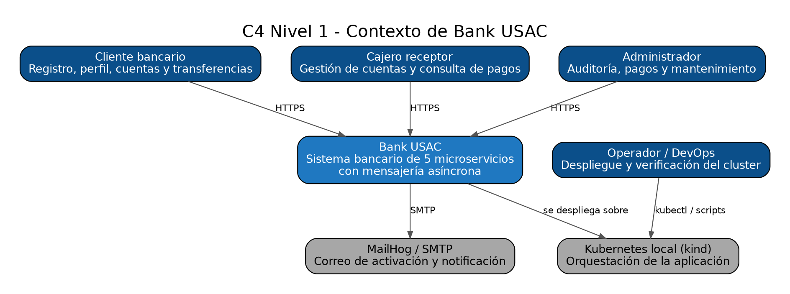
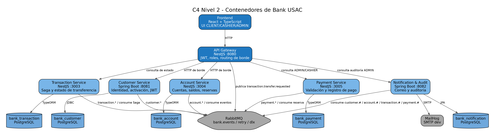

# 1. Visión general de arquitectura

## Objetivo
Bank USAC implementa un sistema bancario académico desacoplado, observable y desplegable localmente. La solución se organiza en cinco bounded contexts con persistencia independiente y un flujo de transferencias distribuido por eventos.

## Restricciones estructurales
- exactamente cinco microservicios de dominio;
- API Gateway como único punto de entrada del backend;
- comunicación inter-microservicio asíncrona por RabbitMQ;
- una base PostgreSQL por microservicio, sin compartir tablas ni consultas SQL cruzadas;
- bases externas al cluster Kubernetes local;
- frontend desacoplado que consume únicamente el Gateway;
- Saga por coreografía, con compensación e idempotencia.

## Stack real
- **Spring Boot:** Customer Service y Notification & Audit Service.
- **NestJS + TypeORM:** Account, Transaction, Payment y API Gateway.
- **React + TypeScript:** frontend.
- **RabbitMQ:** exchange principal `bank.events`, retry `bank.events.retry` y dead-letter `bank.events.dlx`.
- **PostgreSQL 17:** cinco bases independientes.
- **kind + Kubernetes:** despliegue local.
- **MailHog:** correo de activación y notificación en entorno académico.

## C4 Nivel 1

## C4 Nivel 2

## C4 Nivel 3
- [Customer Service](../assets/diagramas/c4-component-customer.png)
- [Account Service](../assets/diagramas/c4-component-account.png)
- [Transaction Service](../assets/diagramas/c4-component-transaction.png)
- [Payment Service](../assets/diagramas/c4-component-payment.png)
- [Notification & Audit Service](../assets/diagramas/c4-component-notification-audit.png)

## Principio de comunicación
El Gateway puede realizar llamadas HTTP de borde al servicio propietario para operaciones request/response, por ejemplo registro, perfil, cuentas, consulta de pagos o consulta de estado. La transferencia distribuida no usa llamadas HTTP entre los cinco microservicios: Gateway publica `transaction.transfer.requested` y el resto del proceso avanza por eventos.
