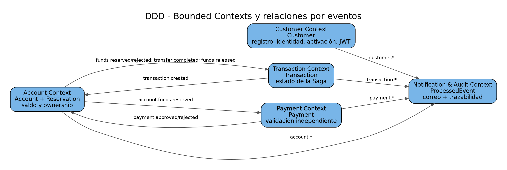

# 2. Modelo de dominio y bounded contexts

## Customer Context
**Entidad:** `Customer`.

Campos relevantes: identificador interno, `customerId` lógico `CUST-n`, email, username, password hash, nombre, documento, evidencia fotográfica, fecha de nacimiento, dirección, rol, `identityStatus`, estado y token de activación.

Reglas implementadas:
- mayoría de edad mínima de 18 años;
- documento con formato válido y único;
- email y username únicos;
- registro público siempre crea rol `CLIENT`;
- estado inicial `PENDING_ACTIVATION` y posterior `ACTIVE`;
- identidad queda `VALIDATED` cuando el registro cumple las validaciones.

## Account Context
**Entidades:** `AccountEntity`, `ReservationEntity`, `ProcessedEventEntity`.

Tipos de cuenta: `MONETARY` y `SAVINGS`. La cuenta mantiene `balance`, `reservedBalance`, `status` y `lastActivityAt`. El saldo disponible se calcula como `balance - reservedBalance`.

La reserva asociada a `transactionId` separa el bloqueo temporal de fondos del débito definitivo. Estados observables de reserva: `RESERVED`, `COMPLETED` y `RELEASED`.

Regla temporal: cada medianoche se desactivan cuentas `ACTIVE` con más de seis meses sin actividad y saldo menor a Q50.

## Transaction Context
**Entidad de dominio:** `Transaction`.

Estados:
`PENDING -> PROCESSING -> COMPLETED`

Ramas de error:
- `PENDING/PROCESSING -> FAILED` ante rechazo no compensable;
- `PROCESSING -> COMPENSATING -> COMPENSATED` cuando Payment rechaza después de reservar fondos.

## Payment Context
**Entidades:** `PaymentEntity`, `ProcessedEventEntity`.

Payment no modifica saldos. Consume una reserva válida y registra `APPROVED` o `REJECTED`. En la configuración académica se rechaza un monto no positivo y se usa `PAYMENT_MAX_AMOUNT=1000000` para provocar de forma determinística un escenario de compensación.

## Notification & Audit Context
**Entidad:** `ProcessedEvent`.

Cada evento auditado conserva `eventId`, `eventType`, versión, `correlationId`, payload, timestamp del evento y timestamp de procesamiento. El mismo contexto envía correo de activación y notificación de transferencia recibida.

## Límites DDD
Cada contexto es propietario exclusivo de su persistencia. No existen foreign keys ni consultas SQL entre bases de distintos servicios. La integración se realiza mediante identificadores de contrato y eventos.

