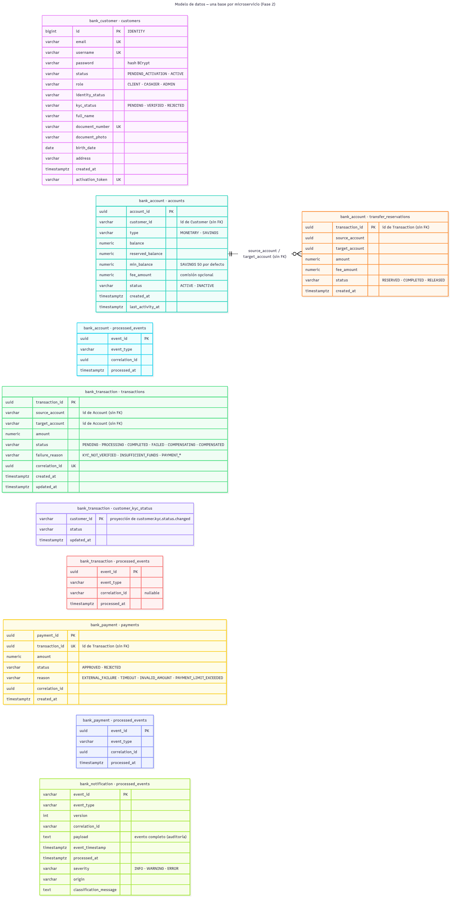

# 2. Modelo de dominio y bounded contexts

Documento único del modelo de dominio (Fase 2): entidades, estados y reglas de cada bounded context, y el diagrama entidad-relación por base de datos.

## Customer Context
**Entidad:** `Customer`.

Campos relevantes: identificador interno, `customerId` lógico `CUST-n`, email, username, password hash, nombre, documento, evidencia fotográfica, fecha de nacimiento, dirección, rol, `identityStatus`, `kycStatus`, estado y token de activación.

Reglas implementadas:
- mayoría de edad mínima de 18 años;
- documento con formato válido y único;
- email y username únicos;
- registro público siempre crea rol `CLIENT`;
- estado inicial `PENDING_ACTIVATION` y posterior `ACTIVE`;
- identidad queda `VALIDATED` cuando el registro cumple las validaciones.

**KYC (Fase 2):** `kycStatus` inicia en `PENDING` y un `ADMIN` lo cambia a `VERIFIED` o `REJECTED` (`PATCH /api/customers/{customerId}/kyc`). Cada cambio real publica `customer.kyc.status.changed`; repetir el mismo estado no publica un evento duplicado.

## Account Context
**Entidades:** `AccountEntity`, `ReservationEntity`, `ProcessedEventEntity`.

La cuenta mantiene tipo, `balance`, `reservedBalance`, `minBalance`, `feeAmount`, `status` y `lastActivityAt`.

- Tipos de cuenta: `MONETARY` (monetaria, saldo mínimo 0) y `SAVINGS` (ahorro, saldo mínimo 50 por defecto).
- Comisión por transacción (`feeAmount`) opcional por cuenta.

Reglas de negocio:
- El saldo disponible es `balance - reservedBalance`.
- Una transferencia se reserva solo si, después de apartar el monto más la comisión, la cuenta conserva su saldo mínimo; si no, se rechaza con `INSUFFICIENT_FUNDS`.
- Al completarse la transferencia se descuenta el monto más la comisión de la cuenta origen; la cuenta destino recibe solo el monto.
- Los fondos se reservan antes de aplicar la transferencia y se liberan si la operación falla (compensación de la Saga).
- Cada medianoche se desactivan cuentas `ACTIVE` con más de seis meses sin actividad y saldo menor a Q50.

La reserva asociada a `transactionId` separa el bloqueo temporal de fondos del débito definitivo. Estados de la reserva: `RESERVED`, `COMPLETED` y `RELEASED`.

## Transaction Context
**Entidades:** `Transaction` y la proyección local `CustomerKycStatus`.

Estados internos de la Saga:
`PENDING -> PROCESSING -> COMPLETED`

Ramas de error:
- `PENDING/PROCESSING -> FAILED` ante rechazo no compensable;
- `PROCESSING -> COMPENSATING -> COMPENSATED` cuando Payment rechaza después de reservar fondos.

Estados públicos (historial y `transaction.status.changed`): `COMPLETED` → `APPROVED`; `FAILED` y `COMPENSATED` → `FAILED`; el resto → `PENDING`. Cuando la Saga falla, `failureReason` guarda el motivo (`KYC_NOT_VERIFIED`, `INSUFFICIENT_FUNDS`, `ACCOUNT_NOT_FOUND_OR_INACTIVE`, `PAYMENT_*`).

**Validación KYC:** Transaction mantiene la proyección `customer_kyc_status`, alimentada por `customer.kyc.status.changed`, sin consultar la base de Customer. Un cliente sin registro en la proyección se considera `PENDING`; solo `VERIFIED` puede transferir. Los eventos más antiguos que el último aplicado se ignoran, así un reintento fuera de orden no pisa un estado nuevo.

El historial por cuenta se filtra por rango de fechas y estado público, con paginación.

## Payment Context
**Entidades:** `PaymentEntity`, `ProcessedEventEntity`.

Payment no modifica saldos. Consume una reserva válida y registra `APPROVED` o `REJECTED` con su motivo.

Reglas de negocio:
- Un pago se rechaza si el monto no es válido (menor o igual a cero, `INVALID_AMOUNT`) o supera el límite configurado (`PAYMENT_MAX_AMOUNT`, `PAYMENT_LIMIT_EXCEEDED`).
- Si el monto es válido, se consulta un procesador de pagos externo simulado que responde `SUCCESS`, `FAILURE` (rechazo con `EXTERNAL_FAILURE`) o `TIMEOUT` (rechazo con `TIMEOUT`), con tasas configurables por variables de entorno.
- Hay un solo pago por transacción: un evento repetido no genera un segundo pago.
- El resultado (`payment.approved` o `payment.rejected`) determina si Account aplica la transferencia o libera los fondos reservados.

## Notification & Audit Context
**Entidad:** `ProcessedEvent`.

Cada evento auditado conserva `eventId`, `eventType`, versión, `correlationId`, payload, timestamp del evento, timestamp de procesamiento, severidad y origen. El mismo contexto envía el correo de activación y la notificación de transferencia recibida.

**Clasificación (Fase 2):** cada evento recibe severidad `INFO`, `WARNING` o `ERROR` y un origen (prefijo del tipo de evento, p. ej. `payment`):

| Evento | Severidad |
|---|---|
| `payment.rejected` con `EXTERNAL_FAILURE` | `ERROR` |
| `payment.rejected` con otro motivo (`TIMEOUT`, límite, monto inválido) | `WARNING` |
| `transaction.status.changed` a `FAILED` | `ERROR` |
| `customer.kyc.status.changed` a `REJECTED` | `WARNING` |
| `account.funds.rejected`, `transaction.compensated` | `WARNING` |
| Tipos terminados en `.failed` o `.error` | `ERROR` |
| Resto (registro, activación, cuenta creada, transferencia solicitada, etc.) | `INFO` |

## Límites DDD
Cada contexto es propietario exclusivo de su persistencia. No existen foreign keys ni consultas SQL entre bases de distintos servicios. La integración se realiza mediante identificadores de contrato y eventos.

## Diagrama entidad-relación

Cada microservicio posee su propia base de datos PostgreSQL, sin claves foráneas ni consultas entre bases (regla "database per service"). Los datos de otro servicio se guardan solo como identificadores (por ejemplo `accounts.customer_id` o `payments.transaction_id`) o como proyección alimentada por eventos (`customer_kyc_status`):

| Base | Servicio | Tablas |
| ---- | -------- | ------ |
| `bank_customer` | Customer | `customers` (incluye `kyc_status`) |
| `bank_account` | Account | `accounts` (tipo, saldo mínimo, comisión), `transfer_reservations`, `processed_events` |
| `bank_transaction` | Transaction | `transactions` (incluye `failure_reason`), `customer_kyc_status`, `processed_events` |
| `bank_payment` | Payment | `payments`, `processed_events` |
| `bank_notification` | Notification & Audit | `processed_events` (auditoría con `payload` y clasificación `severity`/`origin`) |

Cada servicio que consume eventos tiene su propia tabla `processed_events` para la idempotencia por `eventId`; no es una tabla compartida. La única relación dibujada es interna de `bank_account` (`accounts` → `transfer_reservations`, por id y sin FK).

Fuente Mermaid: [`c4-src/er-databases.mmd`](c4-src/er-databases.mmd). Las tablas base las crean los ORM (TypeORM en los servicios NestJS, JPA con `ddl-auto: update` en Customer y Notification); los cambios de Fase 2 están en `infrastructure/databases/<servicio>/*.sql`.
