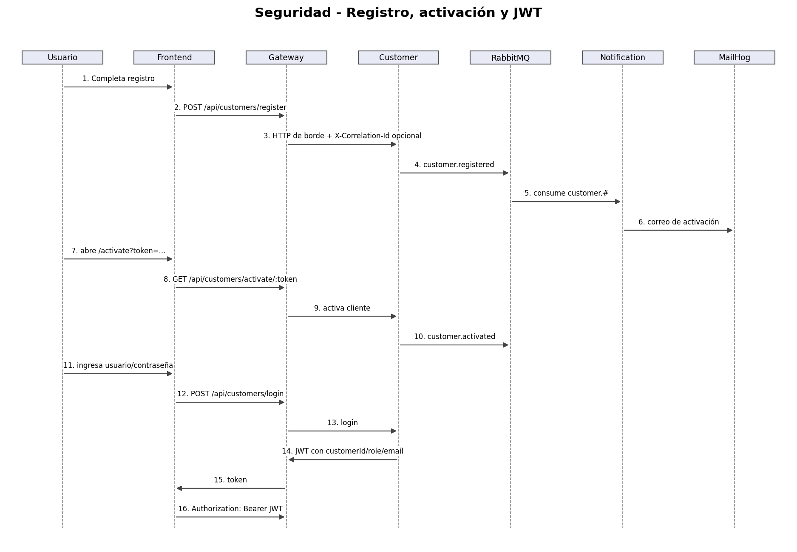

# 3. API Gateway y seguridad

## Responsabilidad del Gateway
El API Gateway NestJS es el único endpoint público del backend. Sus responsabilidades son:
- validar JWT;
- aplicar autorización por roles;
- enrutar request/response hacia el servicio propietario;
- restringir ownership de cuentas para `CLIENT`;
- generar `correlationId` para transferencias;
- publicar `transaction.transfer.requested` en RabbitMQ;
- exponer health/readiness agregada.

No realiza validación de fondos, reservas, pagos, débito/crédito ni transiciones de Saga.

## JWT
Customer Service genera el JWT con secreto compartido. Claims relevantes:
- `sub`: username;
- `customerId`;
- `role`;
- `email`;
- `iat`;
- `exp`.

El Gateway verifica el token con `JwtGuard` y los permisos con `RolesGuard`.

## Roles
| Operación | CLIENT | CASHIER | ADMIN |
|---|:---:|:---:|:---:|
| Registro/activación/login | público | público | público |
| Perfil propio | sí | sí | sí |
| Crear/consultar cuentas | propias | sí | sí |
| Iniciar transferencia | sí | no | no |
| Consultar pagos | no | sí | sí |
| Consultar auditoría | no | no | sí |
| Mantenimiento de cuentas inactivas | no | sí | sí |

## Protección de ownership
En cuentas, un `CLIENT` no puede elegir arbitrariamente `customerId`; el Gateway fuerza el `customerId` contenido en el JWT. Para una transferencia, el Gateway consulta la cuenta origen y rechaza la solicitud si no pertenece al cliente autenticado.

## Seguridad interna en Kubernetes
Los cinco servicios se exponen como `ClusterIP`; solo Frontend y Gateway usan `NodePort`. La `NetworkPolicy` de backend permite ingress desde el Gateway y RabbitMQ.

