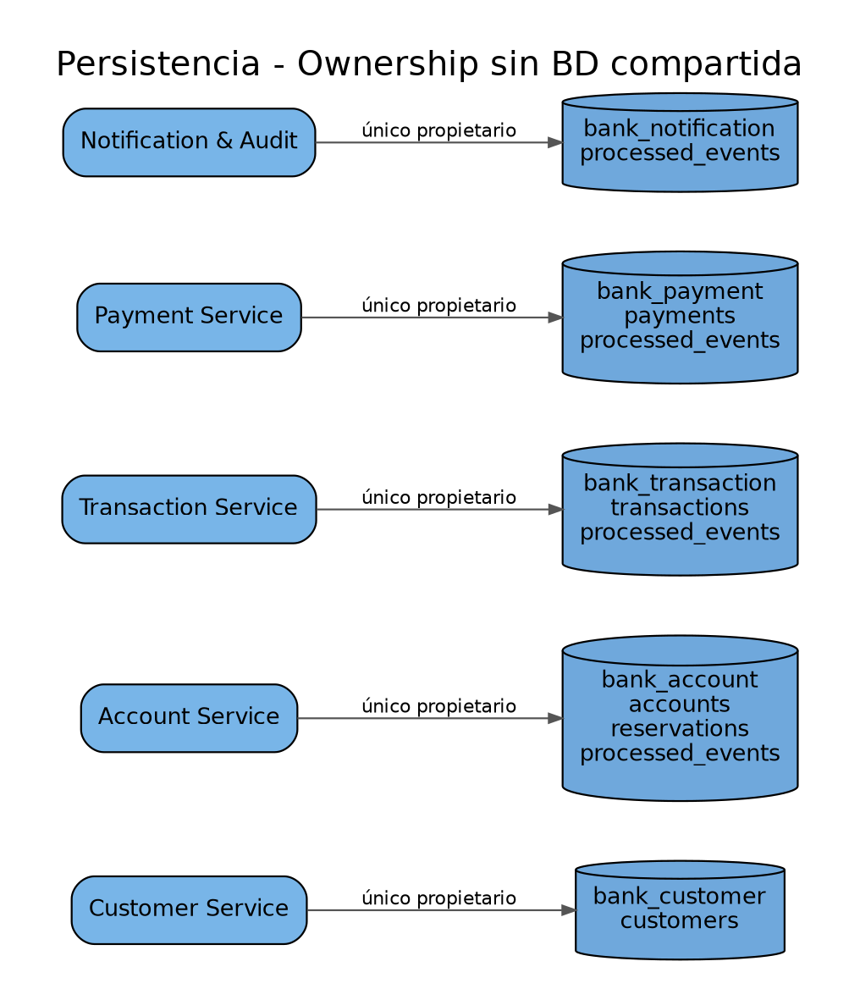

# 4. Persistencia y data ownership

## Bases independientes
| Microservicio | Base | Puerto Docker host | Tablas principales |
|---|---|---:|---|
| Customer | `bank_customer` | 5433 | `customers` |
| Transaction | `bank_transaction` | 5434 | `transactions`, `processed_events` |
| Notification/Audit | `bank_notification` | 5435 | `processed_events` |
| Account | `bank_account` | 5436 | `accounts`, reservas de transferencia, `processed_events` |
| Payment | `bank_payment` | 5437 | `payments`, `processed_events` |

## Reglas de ownership
1. Cada servicio configura únicamente una conexión de base de datos.
2. Ningún servicio consulta tablas de otro bounded context.
3. Los identificadores externos se transportan en eventos o requests como valores, no como claves foráneas entre bases.
4. La consistencia entre contextos es eventual y se resuelve con Saga.

## Kubernetes
En kind, las cinco PostgreSQL permanecen como contenedores Docker fuera del cluster. `start-k8s.sh` detecta la IP gateway del host y reemplaza `__HOST_GATEWAY__` en los manifiestos antes del despliegue.

