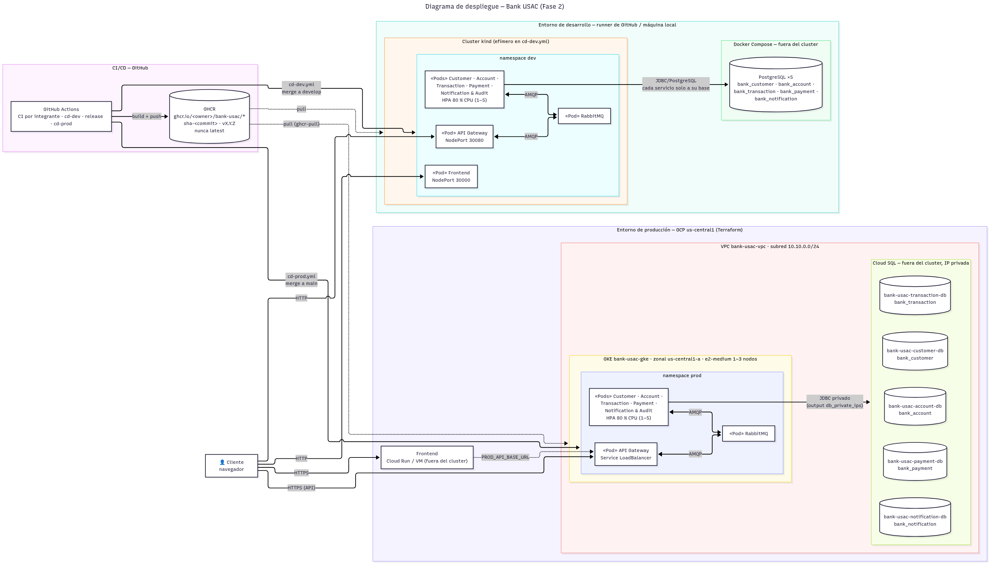

# 6. Catálogo de diagramas

Todos los PNG están en `docs/assets/diagramas/`. Los editables correspondientes están fuera de `docs`, en la carpeta `drawio/` del paquete de entrega.

| Diagrama | Evidencia |
|---|---|
| C4 Nivel 1 | `c4-context.png` |
| C4 Nivel 2 | `c4-container.png` |
| C4 Nivel 3 Customer | `c4-component-customer.png` |
| C4 Nivel 3 Account | `c4-component-account.png` |
| C4 Nivel 3 Transaction | `c4-component-transaction.png` |
| C4 Nivel 3 Payment | `c4-component-payment.png` |
| C4 Nivel 3 Notification/Audit | `c4-component-notification-audit.png` |
| Bounded contexts | `bounded-contexts.png` |
| Data ownership | `data-ownership.png` |
| Topología RabbitMQ | `event-topology.png` |
| Seguridad/JWT | `auth-security-flow.png` |
| Saga happy path | `saga-success.png` |
| Saga compensación | `saga-compensation.png` |
| Secuencia transferencia | `sequence-transfer.png` |
| Secuencia transferencia fallida / compensación | `sequence-transfer-failure.png` |
| Secuencia creación cuenta | `sequence-create-account.png` |
| Retry/DLQ | `retry-dlq-flow.png` |
| Observabilidad | `observability-correlation.png` |
| Despliegue Fase 2 (dev kind + prod GCP) | `deployment-fase2.png` (fuente: [`c4-src/deployment.mmd`](c4-src/deployment.mmd)) |
| UML Deployment (Fase 1, kind local) | `uml-deployment.png` |
| UML casos de uso | `uml-use-cases.png` |
| Arranque | `startup-flow.png` |
| Flujo de demostración | `demo-flow.png` |
| E2E | `e2e-test-flow.png` |

## Galería rápida

## Actualización Fase 2 — Integrante 1

La documentación detallada de los diagramas actualizados se encuentra en:

- [C4 Nivel 1 — Contexto Fase 2](07-c4-contexto-fase2.md)
- [C4 Nivel 3 — Customer y Notification & Audit](08-c4-componentes-integrante1-fase2.md)

## Actualización Fase 2 — Integrante 3

- [C4 Nivel 2 — Contenedores Fase 2](09-c4-contenedores-fase2.md): registry, pipeline, namespaces `dev`/`prod`, HPA y bases de datos fuera del cluster.
- [C4 Nivel 3 — Transaction Service](../assets/diagramas/c4-component-transaction.png): historial por cuenta, proyección KYC, `transaction.status.changed`, idempotencia con `eventId` determinista.
- Secuencias de transferencia en [Saga de transferencia](../03-saga/01-saga-transferencia.md): `sequence-transfer.png` (éxito con KYC y pago simulado) y `sequence-transfer-failure.png` (KYC, fondos insuficientes y compensación).

Fuentes Mermaid: `c4-src/c4-container.mmd`, `c4-src/c4-component-transaction.mmd`, `c4-src/sequence-transfer.mmd` y `c4-src/sequence-transfer-failure.mmd`.

Las fuentes Mermaid reproducibles se conservan en `c4-src/`.
