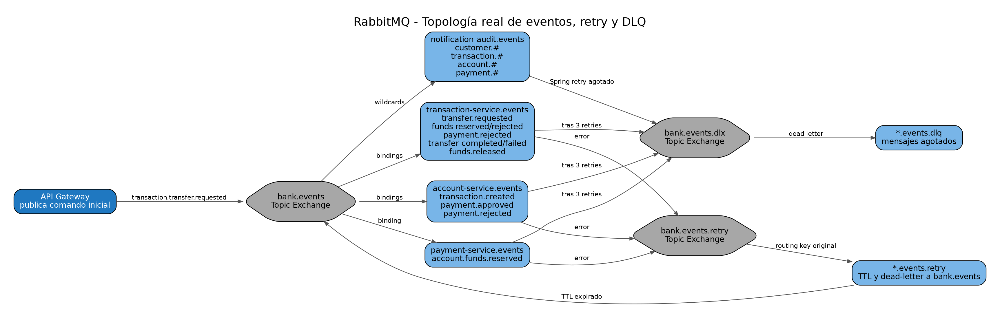

# 6. Catálogo de diagramas

Todos los PNG están en `docs/assets/diagramas/`. Los editables correspondientes están fuera de `docs`, en la carpeta `drawio/` del paquete de entrega.

| Diagrama | Evidencia |
|---|---|
| C4 Nivel 1 | `c4-context.png` |
| C4 Nivel 2 | `c4-container.png` |
| C4 Nivel 3 Customer | `c4-component-customer.png` |
| C4 Nivel 3 Account | `c4-component-account.png` |
| C4 Nivel 3 Transaction | `c4-component-transaction.png` |
| C4 Nivel 3 Payment | `c4-component-payment.png` |
| C4 Nivel 3 Notification/Audit | `c4-component-notification-audit.png` |
| Bounded contexts | `bounded-contexts.png` |
| Data ownership | `data-ownership.png` |
| Topología RabbitMQ | `event-topology.png` |
| Seguridad/JWT | `auth-security-flow.png` |
| Saga happy path | `saga-success.png` |
| Saga compensación | `saga-compensation.png` |
| Secuencia transferencia | `sequence-transfer.png` |
| Secuencia creación cuenta | `sequence-create-account.png` |
| Retry/DLQ | `retry-dlq-flow.png` |
| Observabilidad | `observability-correlation.png` |
| UML Deployment | `uml-deployment.png` |
| UML casos de uso | `uml-use-cases.png` |
| Arranque | `startup-flow.png` |
| Flujo de demostración | `demo-flow.png` |
| E2E | `e2e-test-flow.png` |

## Galería rápida

