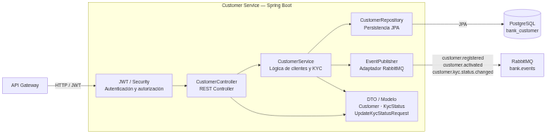
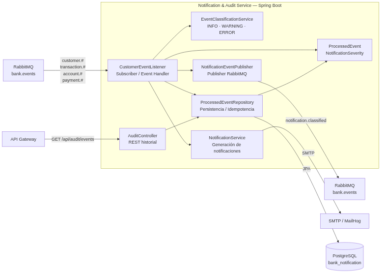

# 8. C4 Nivel 3 — Componentes Fase 2

Este documento actualiza los diagramas de componentes correspondientes a los bounded contexts propiedad del Integrante 1: Customer Service y Notification & Audit Service.

## Customer Service

Customer Service administra clientes, autenticación, perfil y estado KYC.

### Componentes

| Componente | Responsabilidad |
|---|---|
| `CustomerController` | Expone endpoints REST de registro, autenticación, perfil y actualización KYC |
| `CustomerService` | Implementa reglas de negocio de clientes y transiciones KYC |
| `CustomerRepository` | Acceso exclusivo a `bank_customer` mediante JPA |
| `EventPublisher` | Publica eventos de Customer en `bank.events` |
| Seguridad JWT | Autentica solicitudes y restringe operaciones según rol |
| `Customer`, `KycStatus`, DTO | Modelo de dominio y contratos internos |

### Flujo KYC

La actualización del estado KYC sigue el flujo:

`API Gateway → CustomerController → CustomerService → CustomerRepository`

Cuando el estado cambia se publica:

`customer.kyc.status.changed`

Payload principal:

- `customerId`;
- `estadoAnterior`;
- `estadoNuevo`.

Los estados admitidos son:

- `PENDING`;
- `VERIFIED`;
- `REJECTED`.

Si se solicita establecer nuevamente el mismo estado, el servicio mantiene comportamiento idempotente y no publica un evento duplicado.

### Diagrama

---

## Notification & Audit Service

Notification & Audit consume eventos del sistema, evita procesamientos duplicados, los clasifica y conserva su historial.

### Componentes

| Componente | Responsabilidad |
|---|---|
| `CustomerEventListener` | Subscriber RabbitMQ para eventos de Customer, Account, Transaction y Payment |
| `EventClassificationService` | Clasifica eventos como `INFO`, `WARNING` o `ERROR` |
| `NotificationService` | Ejecuta las notificaciones correspondientes |
| `NotificationEventPublisher` | Publica `notification.classified` |
| `ProcessedEventRepository` | Persiste eventos e implementa idempotencia por `eventId` |
| `AuditController` | Expone `GET /api/audit/events` |
| `ProcessedEvent` | Almacena trazabilidad, payload y clasificación |

### Clasificación

Ejemplos implementados:

| Evento / resultado | Clasificación |
|---|---|
| KYC `VERIFIED` | `INFO` |
| KYC `REJECTED` | `WARNING` |
| `payment.approved` | `INFO` |
| `payment.rejected` con `reason` `EXTERNAL_FAILURE` | `ERROR` |
| `payment.rejected` con otro `reason` (`TIMEOUT`, `PAYMENT_LIMIT_EXCEEDED`, `INVALID_AMOUNT`) | `WARNING` |
| `account.funds.rejected` | `WARNING` |
| `transaction.compensated` | `WARNING` |
| `transaction.status.changed` a `FAILED`, o eventos `*.failed` | `ERROR` |
| Cualquier otro evento | `INFO` |

### Idempotencia y trazabilidad

Antes de procesar un evento se consulta su `eventId`.

Si ya existe, el evento se ignora y no se vuelve a persistir ni se genera una nueva clasificación.

Los eventos derivados preservan el `correlationId` del flujo original.

`notification.classified` utiliza además `causationId` para relacionar el nuevo evento con el evento que originó la clasificación.

### Persistencia

`ProcessedEventRepository` utiliza exclusivamente la base:

`bank_notification`

Cada evento nuevo puede almacenar:

- `eventId`;
- `eventType`;
- `version`;
- `correlationId`;
- payload;
- timestamp del evento;
- timestamp de procesamiento;
- severidad;
- origen;
- mensaje de clasificación.

### Diagrama

