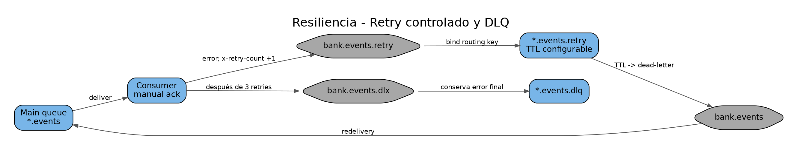

# 8. Topología RabbitMQ

## Exchanges
| Exchange | Tipo | Uso |
|---|---|---|
| `bank.events` | topic | eventos normales |
| `bank.events.retry` | topic | eventos que requieren reintento |
| `bank.events.dlx` | topic | eventos agotados / dead letter |

## Colas principales
### `transaction-service.events`
Bindings:
- `transaction.transfer.requested`
- `account.funds.reserved`
- `account.funds.rejected`
- `payment.rejected`
- `account.transfer.completed`
- `account.transfer.failed`
- `account.funds.released`

### `account-service.events`
Bindings:
- `transaction.created`
- `payment.approved`
- `payment.rejected`

### `payment-service.events`
Binding:
- `account.funds.reserved`

### `notification-audit.events`
Bindings wildcard:
- `customer.#`
- `transaction.#`
- `account.#`
- `payment.#`

## Retry
Transaction, Account y Payment usan colas `.retry` durables con TTL. Al expirar el TTL, el mensaje regresa a `bank.events` conservando la routing key original. El header `x-retry-count` limita la cantidad de intentos a 3 por defecto.

Notification/Audit usa retry stateless de Spring con 3 reintentos y posteriormente dead-lettering.

## DLQ
Cada participante posee una cola dead-letter para evitar pérdida silenciosa y permitir inspección manual.

