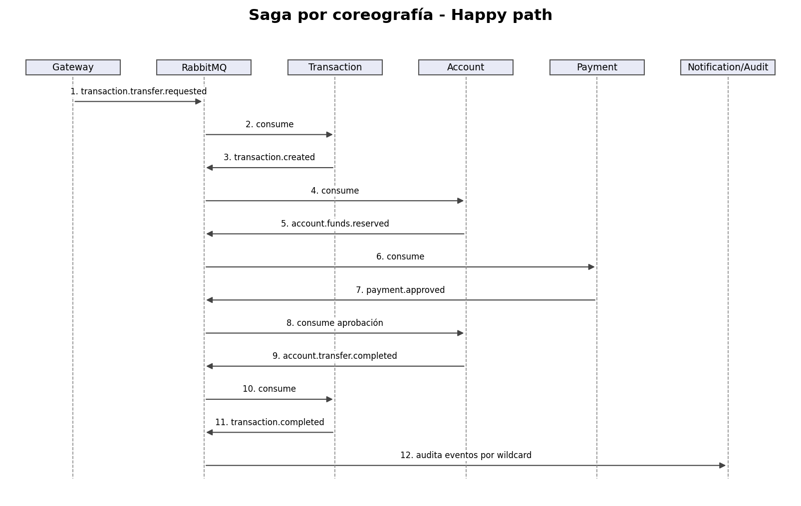
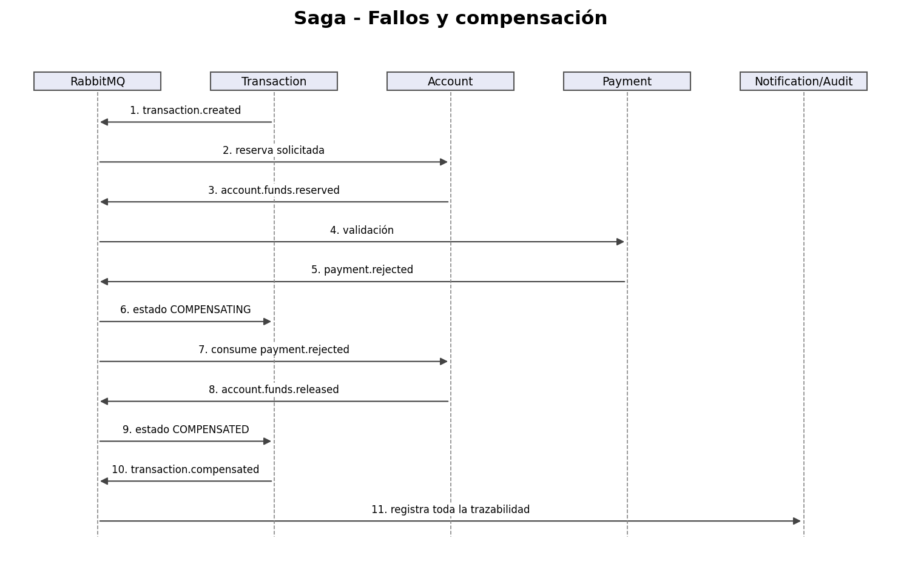
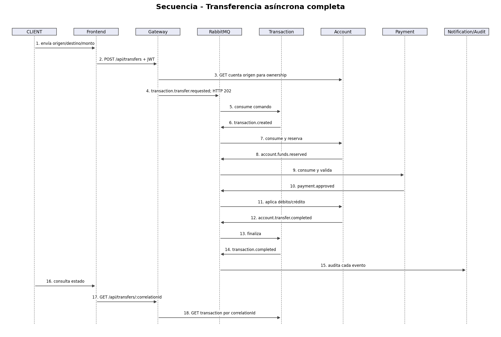

# 9. Saga de transferencia por coreografía

## Premisa
La transferencia no usa una transacción global ni un orquestador. Cada servicio persiste su estado local y publica el resultado mediante RabbitMQ.

## Camino exitoso
1. Gateway valida JWT/ownership y publica `transaction.transfer.requested`.
2. Transaction crea una transacción `PENDING` y publica `transaction.created`.
3. Account valida cuentas/fondos, incrementa `reservedBalance` y publica `account.funds.reserved`.
4. Transaction pasa a `PROCESSING`.
5. Payment registra la validación y publica `payment.approved`.
6. Account debita origen, acredita destino, libera la reserva y publica `account.transfer.completed`.
7. Transaction cambia a `COMPLETED` y publica `transaction.completed`.

## Fondos insuficientes
Si Account no encuentra cuentas activas o el saldo disponible es menor al monto, publica `account.funds.rejected`. Transaction cambia a `FAILED` y emite `transaction.failed`. No se modifica balance.

## Rechazo posterior a reserva
1. Account ya reservó fondos.
2. Payment publica `payment.rejected`.
3. Transaction cambia a `COMPENSATING`.
4. Account consume el rechazo, disminuye `reservedBalance`, marca la reserva `RELEASED` y publica `account.funds.released`.
5. Transaction cambia a `COMPENSATED` y publica `transaction.compensated`.

El saldo original queda restaurado porque el débito definitivo nunca se ejecutó.

## Estados de Transaction
- `PENDING`: creada;
- `PROCESSING`: fondos reservados;
- `COMPLETED`: transferencia aplicada;
- `FAILED`: rechazo no compensable;
- `COMPENSATING`: reversión de reserva en curso;
- `COMPENSATED`: compensación confirmada.

## Secuencia completa

