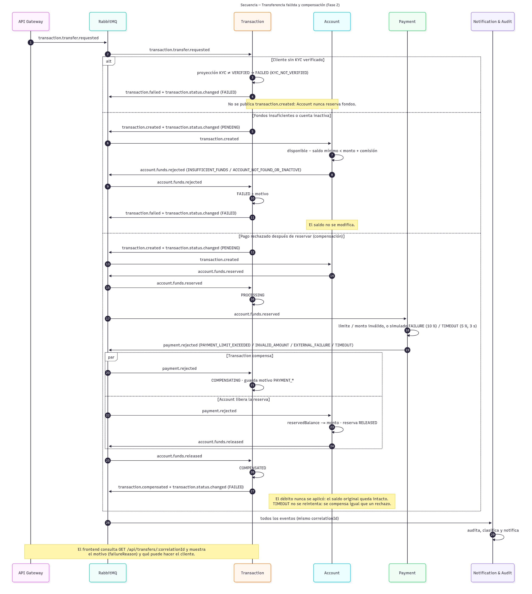

# 9. Saga de transferencia por coreografía

## Premisa
La transferencia no usa una transacción global ni un orquestador. Cada servicio persiste su estado local y publica el resultado mediante RabbitMQ.

Todos los eventos de una transferencia comparten el mismo `correlationId`: el que fija el Gateway a partir del header `X-Correlation-Id` (ver [contratos de eventos](../02-eventos/01-contratos-eventos.md)).

## Camino exitoso
1. Gateway valida JWT/ownership y publica `transaction.transfer.requested` con el `customerId` del cliente en `requestedBy`.
2. Transaction crea una transacción `PENDING`, verifica que el cliente tenga KYC `VERIFIED` y publica `transaction.created`.
3. Account valida cuentas y fondos (respetando el saldo mínimo de la cuenta origen y reservando también la comisión, si la hay), incrementa `reservedBalance` y publica `account.funds.reserved`.
4. Transaction pasa a `PROCESSING`.
5. Payment consulta al procesador externo simulado; si responde `SUCCESS`, publica `payment.approved`.
6. Account debita origen, acredita destino, libera la reserva y publica `account.transfer.completed`.
7. Transaction cambia a `COMPLETED` y publica `transaction.completed`.

En los pasos 2, 7 y en cada estado terminal, Transaction publica además `transaction.status.changed` con el estado público (`PENDING`, `APPROVED` o `FAILED`), que consume Notification/Audit.

## Cliente sin KYC verificado (Fase 2)
Transaction mantiene una proyección local del estado KYC (`customer_kyc_status`) alimentada por `customer.kyc.status.changed`, sin llamadas síncronas a Customer. Si el cliente no está `VERIFIED` (o no hay registro, que cuenta como `PENDING`), la transacción queda `FAILED` con motivo `KYC_NOT_VERIFIED` y se publican `transaction.failed` y `transaction.status.changed`. No se publica `transaction.created`, así que Account nunca reserva fondos.

## Fondos insuficientes
Si Account no encuentra cuentas activas (`ACCOUNT_NOT_FOUND_OR_INACTIVE`) o el saldo disponible (balance − reservado − saldo mínimo) es menor que monto + comisión (`INSUFFICIENT_FUNDS`), publica `account.funds.rejected` con el motivo. Transaction cambia a `FAILED`, guarda el motivo y emite `transaction.failed`. No se modifica balance.

## Rechazo posterior a reserva
1. Account ya reservó fondos.
2. Payment publica `payment.rejected` con uno de estos motivos: `PAYMENT_LIMIT_EXCEEDED`, `INVALID_AMOUNT` o, en Fase 2, el resultado simulado del procesador externo: `EXTERNAL_FAILURE` (10 % por defecto) o `TIMEOUT` (5 % por defecto, tras 3 s de espera). Las tasas se configuran con `PAYMENT_SIMULATE_FAILURE_RATE` y `PAYMENT_SIMULATE_TIMEOUT_RATE`.
3. Transaction cambia a `COMPENSATING`.
4. Account consume el rechazo, disminuye `reservedBalance`, marca la reserva `RELEASED` y publica `account.funds.released`.
5. Transaction cambia a `COMPENSATED` y publica `transaction.compensated`.

El saldo original queda restaurado porque el débito definitivo nunca se ejecutó. Un `TIMEOUT` no se reintenta: se compensa igual que un rechazo. Transaction guarda el motivo con prefijo `PAYMENT_` (`PAYMENT_TIMEOUT`, `PAYMENT_EXTERNAL_FAILURE`, …) y lo conserva hasta `COMPENSATED`.

## Estados de Transaction
- `PENDING`: creada;
- `PROCESSING`: fondos reservados;
- `COMPLETED`: transferencia aplicada;
- `FAILED`: rechazo no compensable;
- `COMPENSATING`: reversión de reserva en curso;
- `COMPENSATED`: compensación confirmada.

Cuando la Saga falla o compensa, el motivo queda en `failure_reason` y se ve en el historial (`failureReason`).

## Idempotencia y reintentos (Fase 2)
- Cada consumidor registra el `eventId` de los eventos procesados y descarta duplicados.
- Transaction genera `eventId` deterministas por transacción y transición. Si reprocesa un evento (por ejemplo, porque cayó antes de marcarlo como procesado), republica los mismos `eventId` y los consumidores descartan la copia.
- Cada evento publicado por Transaction lleva en `causationId` el `eventId` del evento que lo provocó.
- Un evento de una etapa ya superada (reentrega tardía) se ignora sin error y sin publicar nada. Uno que llega antes de tiempo (por ejemplo, `payment.rejected` antes de que Transaction procese `account.funds.reserved`) falla a propósito y se reintenta desde la cola `.retry` (hasta 3 veces, luego DLQ), cuando ya está en orden.
- En el Gateway, reenviar `POST /api/transfers` con el mismo `X-Correlation-Id` es un reintento: Transaction no crea una segunda transacción.

## Secuencia completa
Transferencia exitosa, con la validación KYC, el pago simulado, `transaction.status.changed` y el seguimiento del frontend por `correlationId`:

Fallos y compensación (KYC no verificado, fondos insuficientes y pago rechazado después de la reserva):

Fuentes Mermaid: `docs/01-arquitectura/c4-src/sequence-transfer.mmd` y `sequence-transfer-failure.mmd`.

> `saga-success.png` y `saga-compensation.png` son la vista general de Fase 1; el detalle de Fase 2 está en las dos secuencias de arriba.
