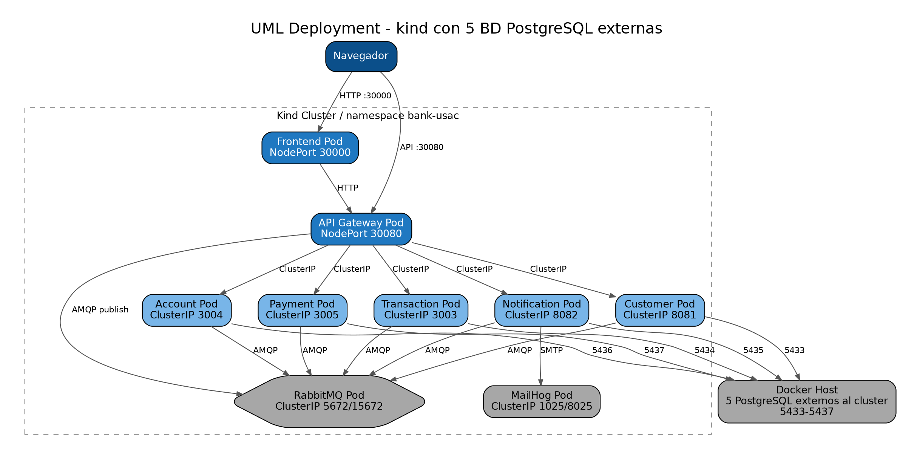
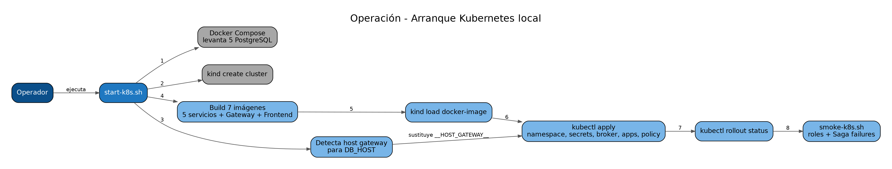

# 11. Despliegue Kubernetes local con kind

## Comando
```bash
./scripts/project/start-k8s.sh
```

El script:
1. levanta únicamente las cinco PostgreSQL en Docker Compose;
2. crea el cluster kind `bank-usac`;
3. detecta la IP gateway del Docker host;
4. construye las imágenes locales;
5. las carga en kind;
6. sustituye `__HOST_GATEWAY__` en los manifests de los cinco servicios;
7. aplica namespace, secretos, RabbitMQ, MailHog, servicios, Gateway, Frontend y NetworkPolicy;
8. espera los rollouts.

## Servicios Kubernetes
- Frontend: NodePort `30000`;
- Gateway: NodePort `30080`;
- Customer, Account, Transaction, Payment y Notification/Audit: `ClusterIP`;
- RabbitMQ y MailHog: internos al cluster;
- PostgreSQL: fuera del cluster, en Docker host.

## Verificación
```bash
kubectl get pods -n bank-usac
kubectl get svc -n bank-usac
kubectl get networkpolicy -n bank-usac
```

Todos los pods de aplicación deben aparecer `1/1 Running`.




