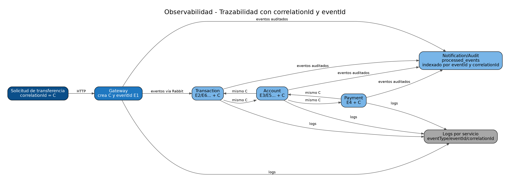

# 13. Resiliencia y observabilidad

## Idempotencia
- Transaction mantiene `processed_events` mediante `EventIdempotencyService`.
- Account mantiene `ProcessedEventEntity`.
- Payment mantiene `ProcessedEventEntity`.
- Notification/Audit usa `eventId` como clave única en `processed_events`.

Un evento duplicado no debe repetir el efecto de negocio.

## Retry y DLQ
Transaction, Account y Payment:
- `noAck: false`;
- `ack` después de procesamiento correcto;
- error -> `bank.events.retry`;
- `x-retry-count` incrementa;
- retry máximo por defecto: 3;
- después del máximo -> `bank.events.dlx` y cola `.dlq`.

Notification/Audit usa `RetryInterceptorBuilder.stateless().maxRetries(3)` y dead-letter routing `notification.audit.failed`.

## Trazabilidad
`correlationId` se mantiene constante durante toda la Saga. `eventId` cambia por evento. Esto permite reconstruir la secuencia completa en:
- logs de servicios;
- propiedades AMQP;
- tabla `processed_events` de auditoría;
- endpoint ADMIN `/api/audit/events`.

## Health y readiness
- Gateway: `/health` y `/health/ready`;
- Customer/Notification: Actuator health;
- Account/Payment/Transaction: `/health` o probes TCP según manifiesto.

