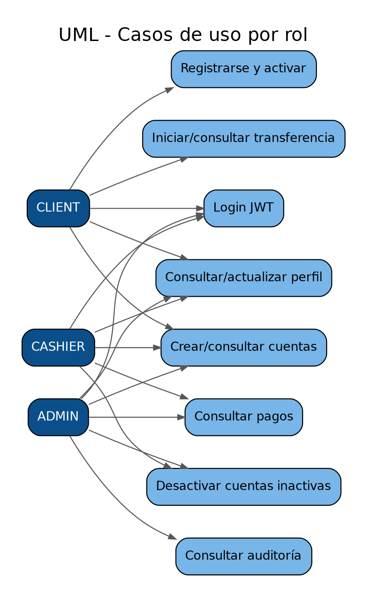

# 15. Casos de uso

## CLIENT
- registrarse;
- recibir correo y activar la cuenta;
- autenticarse con JWT;
- consultar y actualizar perfil;
- crear cuenta `MONETARY` o `SAVINGS` propia;
- listar cuentas y consultar saldo disponible;
- iniciar transferencia desde una cuenta propia;
- consultar estado por `correlationId`.

## CASHIER
- autenticarse con usuario sembrado;
- consultar/crear cuentas usando `customerId` cuando corresponde;
- consultar pagos procesados;
- consultar pago por `transactionId`;
- ejecutar mantenimiento autorizado de cuentas inactivas.

El backend no autoriza al CASHIER a iniciar transferencias; esa acción está restringida a `CLIENT` en Gateway.

## ADMIN
- autenticarse con usuario sembrado;
- consultar cuentas;
- consultar pagos;
- consultar auditoría distribuida;
- ejecutar mantenimiento de cuentas inactivas.

## Temporizador del sistema
El cron de Account ejecuta automáticamente la desactivación diaria de cuentas con más de seis meses de inactividad y saldo < Q50.

