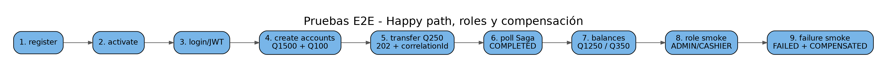

# 16. Estrategia de pruebas

## Validación estática/build
La validación del proyecto compila los servicios, valida Docker Compose y ejecuta las pruebas disponibles de Transaction/Customer según el entorno.

## E2E happy path
`tests/e2e/smoke.sh` ejecuta:
1. registro;
2. activación;
3. login/JWT;
4. creación de cuentas Q1500 y Q100;
5. transferencia Q250;
6. polling por `correlationId`;
7. verificación `COMPLETED`;
8. saldos Q1250 y Q350.

Wrappers:
```bash
./scripts/project/smoke-local.sh
./scripts/project/smoke-k8s.sh
```

## Roles
```bash
./scripts/project/smoke-roles-local.sh
./scripts/project/smoke-roles-k8s.sh
```
Valida ADMIN en auditoría, CASHIER en pagos y denegación de auditoría al cajero.

## Fallo y compensación
```bash
./scripts/project/smoke-saga-failures-local.sh
./scripts/project/smoke-saga-failures-k8s.sh
```
Escenarios:
- fondos insuficientes -> `FAILED`;
- Payment rechaza después de reserva -> `COMPENSATED` y saldo restaurado.


