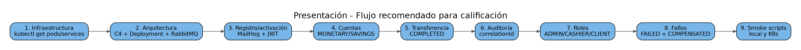

# 17. Guía de demostración para calificación

## Orden recomendado
1. `kubectl get pods -n bank-usac` y `kubectl get svc -n bank-usac`.
2. C4 Nivel 1, C4 Nivel 2 y UML Deployment.
3. RabbitMQ: exchanges, queues y bindings.
4. Registro CLIENT desde frontend Kubernetes `http://localhost:30000`.
5. MailHog por port-forward y correo de activación.
6. Login/JWT y perfil `VALIDATED/ACTIVE`.
7. Crear `MONETARY Q1500` y `SAVINGS Q100`.
8. Intentar transferir antes de verificar el KYC: la transferencia termina `FAILED` con motivo "Cliente sin verificación KYC".
9. ADMIN verifica el KYC del cliente en **Clientes** → **Verificar** (equivale a `PATCH /api/customers/:customerId/kyc` con `{"status":"VERIFIED"}`).
10. Transferir Q250 desde **Transferir**: el estado avanza solo hasta **Completada** y los saldos quedan Q1250/Q350.
11. Abrir **Historial** de la cuenta origen y filtrar por estado.
12. Login ADMIN y mostrar auditoría con el mismo `correlationId` en todos los eventos.
13. Login CASHIER y mostrar pagos; verificar que auditoría no está autorizada.
14. Ejecutar smoke de roles y fallos de Saga.
15. Mostrar retry/DLQ, idempotencia y NetworkPolicy.
16. CI/CD: último `CD - Deploy dev` en verde (GitHub Actions) y la imagen `sha-<commit>` en GHCR ([CI/CD](../04-despliegue/04-ci-cd.md)).

## Evidencias automatizadas
```bash
./scripts/project/smoke-k8s.sh
./scripts/project/smoke-roles-k8s.sh
./scripts/project/smoke-saga-failures-k8s.sh
```

## Frase clave sobre asincronía
> Los cinco microservicios no se invocan entre sí por HTTP para ejecutar una transferencia. El Gateway publica el comando inicial y Transaction, Account, Payment y Notification/Audit avanzan mediante eventos RabbitMQ. Las llamadas HTTP Gateway->servicio son tráfico de borde, no comunicación inter-microservicio.

## Frase clave sobre Saga
> Cada servicio ejecuta una transacción local. Si Payment rechaza después de reservar fondos, Account libera la reserva y Transaction termina `COMPENSATED`; no existe rollback distribuido ACID.


