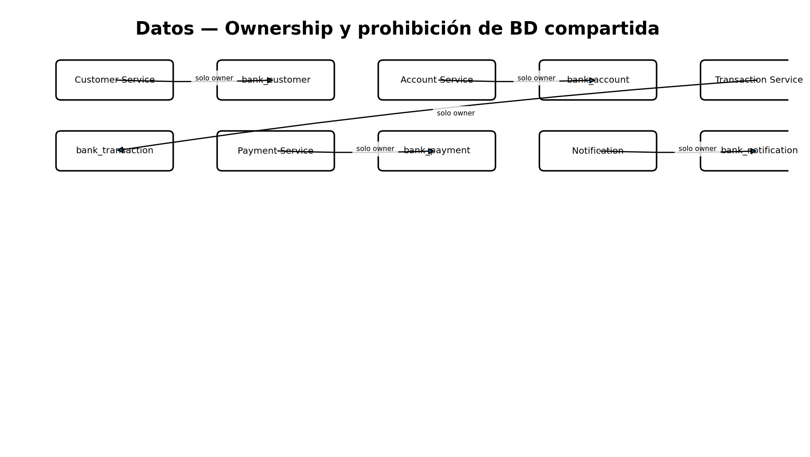

# Persistencia y ownership

| Servicio | BD | Tablas principales |
|---|---|---|
| Customer | bank_customer | customers |
| Account | bank_account | accounts, transfer_reservations, processed_events |
| Transaction | bank_transaction | transactions, processed_events |
| Payment | bank_payment | payments, processed_events |
| Notification | bank_notification | processed_events |

No hay foreign keys ni accesos SQL entre bounded contexts. Los identificadores externos (`customerId`, `accountId`, `transactionId`) se transportan como valores de contrato.

