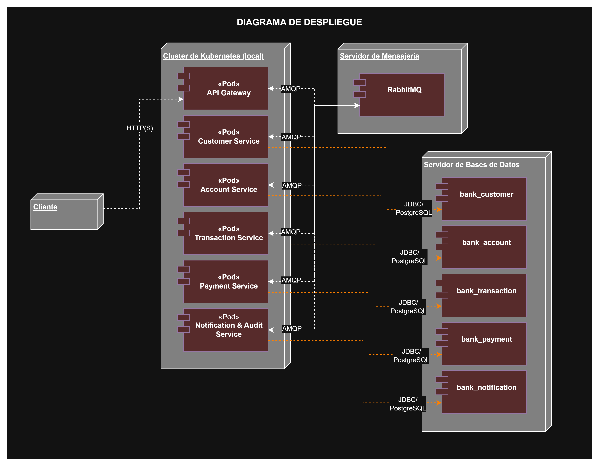

# Diagrama de Despliegue

Este diagrama muestra la arquitectura de despliegue del sistema Bank USAC, incluyendo el cluster de Kubernetes local, los microservicios desplegados como Pods, el broker de mensajería y las bases de datos externas al cluster.

## Elementos representados

- **Cluster de Kubernetes (local)**: contiene los 5 microservicios desplegados como `«Pod»` (API Gateway, Customer Service, Account Service, Transaction Service, Payment Service, Notification & Audit Service).
- **Servidor de Mensajería**: RabbitMQ, externo al cluster, conectado a cada componente vía protocolo `AMQP` en ambos sentidos (publicación y consumo de eventos).
- **Servidor de Bases de Datos**: 5 instancias de PostgreSQL, una por microservicio, externas al cluster, conectadas únicamente a su microservicio correspondiente vía `JDBC/PostgreSQL`.
- **Cliente**: se conecta al API Gateway vía `HTTP(S)`.

## Restricciones respetadas

- Ningún microservicio se comunica directamente con otro; toda comunicación entre microservicios pasa por el broker de mensajería.
- Las bases de datos viven fuera del cluster de Kubernetes.
- Cada microservicio accede únicamente a su propia base de datos.

