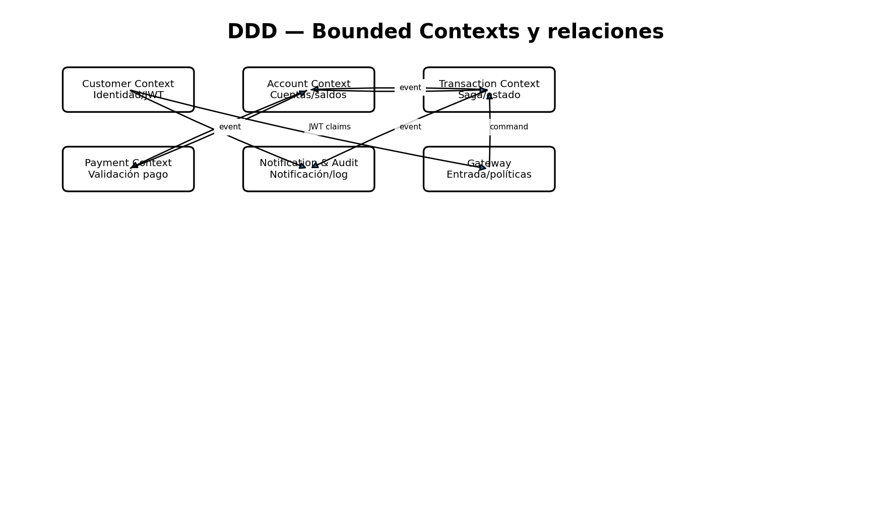

# Modelo de dominio y bounded contexts

## Customer Context
Entidad `Customer`: `customerId`, email, username, password hash, nombre completo, documento, foto de documento, fecha de nacimiento, dirección, rol y estado de activación. Emite eventos de registro, activación y actualización.

## Account Context
Entidad `Account`: cuenta monetaria o de ahorro, saldo, saldo reservado, estado, dueño y última actividad. `TransferReservation` representa una reserva local asociada a `transactionId`. Ningún otro servicio lee esta BD.

## Transaction Context
`Transaction` representa el ciclo de vida de la transferencia: `PENDING → PROCESSING → COMPLETED`, o `FAILED`; tras un fallo posterior a reserva: `PROCESSING → COMPENSATING → COMPENSATED`.

## Payment Context
`Payment` registra la validación financiera independiente: `APPROVED` o `REJECTED`. No modifica saldos.

## Notification & Audit Context
`ProcessedEvent` almacena el envelope, payload, timestamp y `correlationId`. Además procesa notificaciones de activación por SMTP.

## Límites
Cada contexto posee su propia persistencia y no ejecuta consultas SQL contra otra base. Los límites se sincronizan únicamente mediante eventos RabbitMQ.

