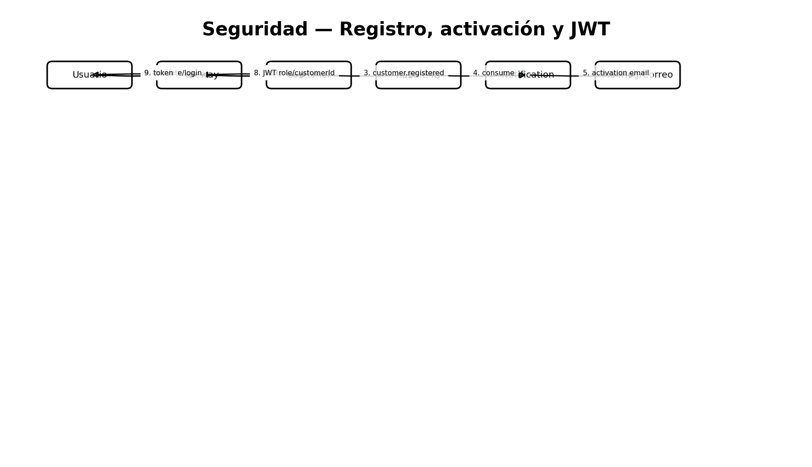

# Seguridad

- Passwords con `PasswordEncoder` de Spring; nunca texto plano.
- JWT firmado con secreto compartido entre Customer y Gateway.
- Claims: `sub`, `customerId`, `role`, `email`, `iat`, `exp`.
- Frontend solo consume Gateway.
- Roles: CLIENT, CASHIER, ADMIN. El registro público crea únicamente CLIENT; ADMIN/CASHIER de demostración son sembrados por configuración.
- Auditoría restringida a ADMIN; pagos a ADMIN/CASHIER.
- Los servicios internos no deben exponerse al usuario final en Kubernetes; se usan ClusterIP salvo Gateway/Frontend.
- `.env`, secretos, `target`, `dist`, `node_modules` y caches están ignorados en Git.

