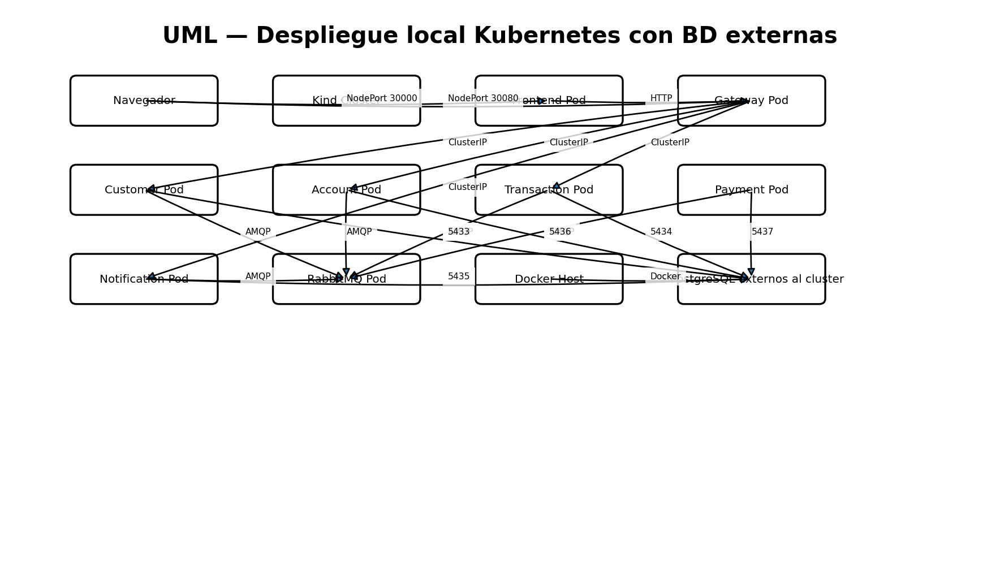

# Despliegue Kubernetes local (kind)

`./scripts/project/start-k8s.sh`:
1. inicia exclusivamente las cinco PostgreSQL con Docker Compose, fuera del cluster;
2. crea `kind` con puertos 30000/30080;
3. detecta la IP gateway del host vista desde el nodo kind;
4. construye y carga imágenes locales;
5. sustituye `__HOST_GATEWAY__` en una copia temporal de manifests;
6. despliega RabbitMQ, MailHog, los cinco microservicios, Gateway y frontend;
7. espera `rollout status`.

Acceso:
- Frontend: `http://localhost:30000`
- Gateway: `http://localhost:30080`

Verificación: `kubectl -n bank-usac get pods,svc`.

