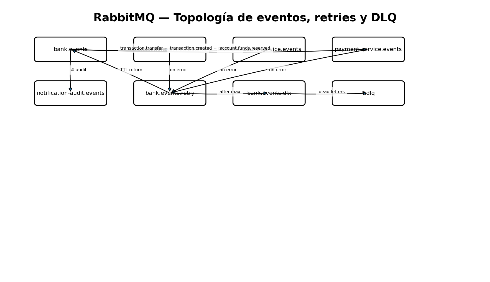

# Eventos y contratos

## Envelope común

```json
{
  "eventId": "uuid",
  "eventType": "domain.action",
  "version": 1,
  "timestamp": "ISO-8601",
  "correlationId": "uuid",
  "payload": {}
}
```

Convención: `dominio.acción`, routing key idéntica a `eventType`, exchange principal `bank.events`.

| Evento | Productor | Consumidores principales | Payload mínimo |
|---|---|---|---|
| `customer.registered` | Customer | Notification/Audit | customerId,email,username,role,activationToken |
| `customer.activated` | Customer | Notification/Audit | customerId,status,role |
| `account.created` | Account | Notification/Audit | accountId,customerId,type,balance,status |
| `transaction.transfer.requested` | Gateway | Transaction | sourceAccount,targetAccount,amount,requestedBy,requestedEmail |
| `transaction.created` | Transaction | Account, Audit | transactionId,sourceAccount,targetAccount,amount,status |
| `account.funds.reserved` | Account | Payment, Transaction, Audit | transactionId,sourceAccount,targetAccount,amount |
| `account.funds.rejected` | Account | Transaction, Audit | transactionId,reason |
| `payment.approved` | Payment | Account, Transaction/Audit | paymentId,transactionId,status |
| `payment.rejected` | Payment | Account, Transaction, Audit | paymentId,transactionId,status,reason |
| `account.transfer.completed` | Account | Transaction, Audit | transactionId,sourceAccount,targetAccount,amount |
| `account.funds.released` | Account | Transaction, Audit | transactionId,amount,reason |
| `transaction.completed` | Transaction | Audit | transactionId,status |
| `transaction.failed` | Transaction | Audit | transactionId,status,reason |
| `transaction.compensated` | Transaction | Audit | transactionId,status |

## Trazabilidad
`eventId` identifica una entrega lógica para idempotencia. `correlationId` permanece constante durante todo el proceso de negocio y permite reconstruir una transferencia entre servicios.


