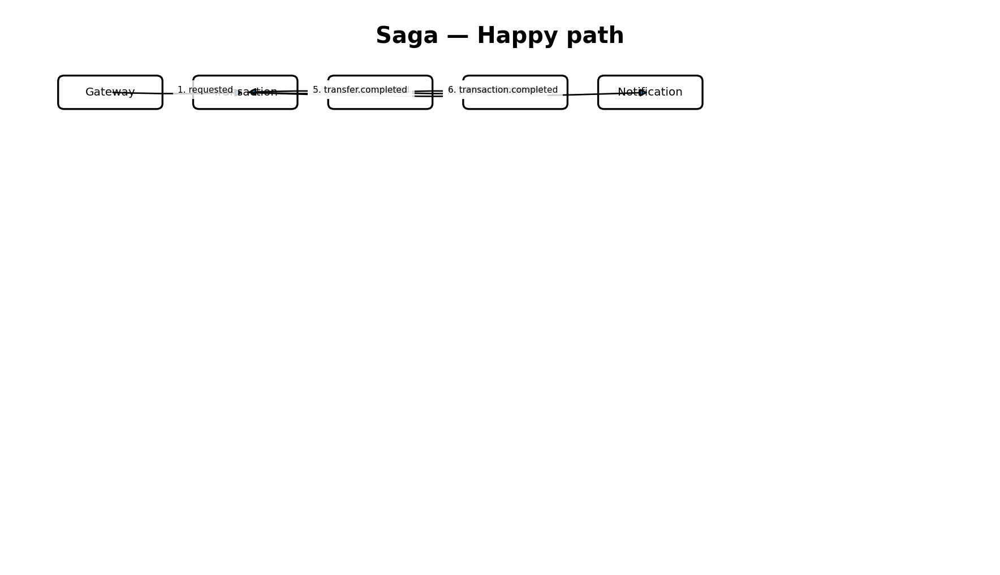
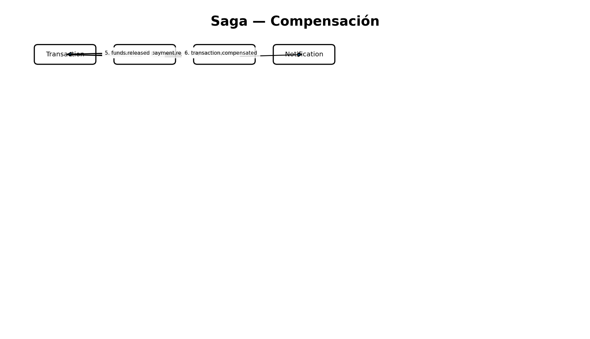

# Saga de transferencia — coreografía

No existe un orquestador central. Cada participante reacciona a eventos y publica el siguiente hecho del dominio.

## Happy path
`transaction.transfer.requested → transaction.created → account.funds.reserved → payment.approved → account.transfer.completed → transaction.completed`.

## Fondos insuficientes
Account publica `account.funds.rejected`; Transaction cambia a `FAILED` y publica `transaction.failed`. No se mueve saldo.

## Fallo posterior a reserva
Payment publica `payment.rejected`. Transaction cambia a `COMPENSATING`; Account libera la reserva y publica `account.funds.released`; Transaction finaliza `COMPENSATED`.

