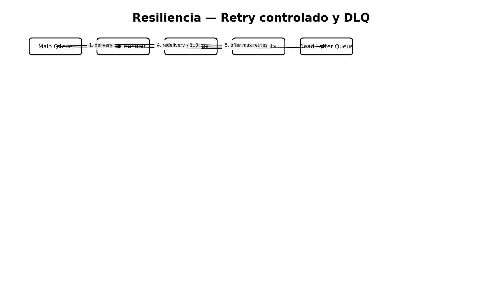
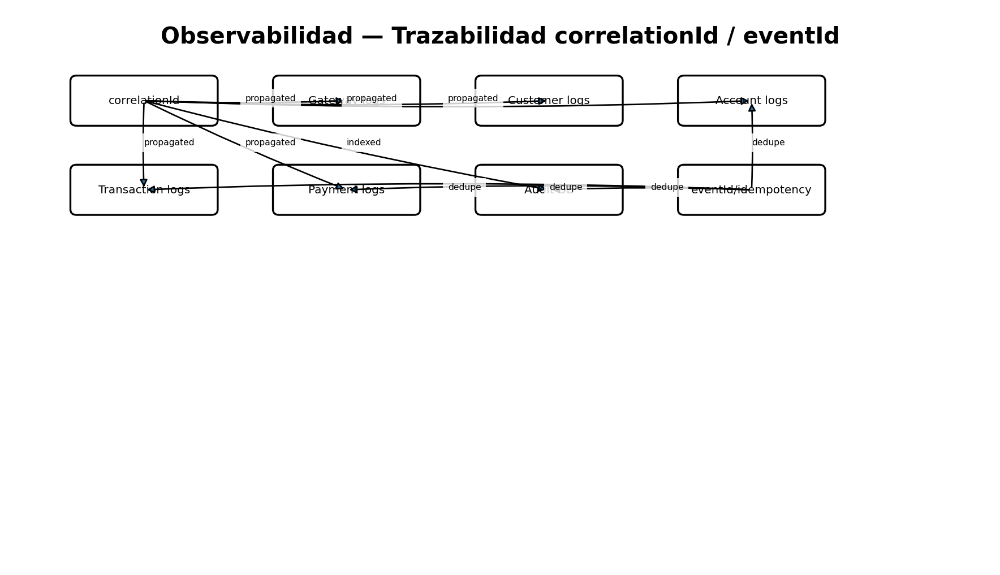

# Resiliencia y observabilidad

- `eventId` se persiste en tablas `processed_events` para deduplicación.
- Transaction, Account y Payment usan retry limitado y DLQ.
- Notification/Audit usa retry de Spring y dead-lettering.
- `correlationId` se conserva en todos los eventos de una Saga.
- RabbitMQ usa colas durables y mensajes persistentes.
- Los servicios exponen logs con tipo de evento, ID y correlationId.
- Notification/Audit mantiene hasta 200 eventos recientes vía API y todos los persistidos en su BD.

