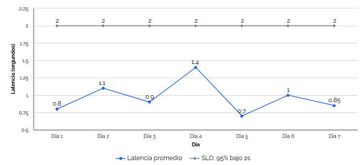
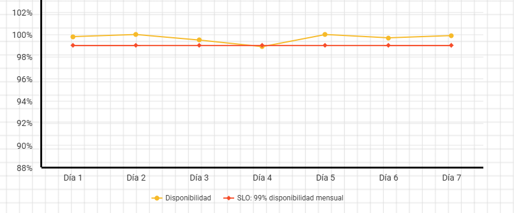

# SLO - Account Service y Payment Service

## Objetivo

Este documento define los objetivos de nivel de servicio (SLO) asociados a los SLI de Account Service y Payment Service.

## 1. Disponibilidad del servicio

**SLO:** 99% de disponibilidad mensual.

## 2. Éxito de operaciones (reserva de fondos y procesamiento de pagos)

**SLO:** 98% de operaciones procesadas sin error interno (`INTERNAL_ERROR`).

## 3. Latencia de procesamiento de eventos

**SLO:** 95% de los eventos procesados en menos de 2 segundos.

*Figura 1. Ejemplo ilustrativo de latencia de procesamiento de eventos de Account Service a lo largo de 7 días, comparado contra el SLO de 2 segundos. Los valores son simulados para fines de documentación; se recomienda reemplazarlos con datos reales una vez el sistema cuente con monitoreo en producción.*

## 4. Consumo de eventos sin pérdida (idempotencia)

**SLO:** 100% de los eventos procesados exactamente una vez.

*Figura 2. Ejemplo ilustrativo del comportamiento de disponibilidad de Account Service a lo largo de 7 días, comparado contra el SLO de 99%. Los valores son simulados para fines de documentación; se recomienda reemplazarlos con datos reales una vez el sistema cuente con monitoreo en producción.*