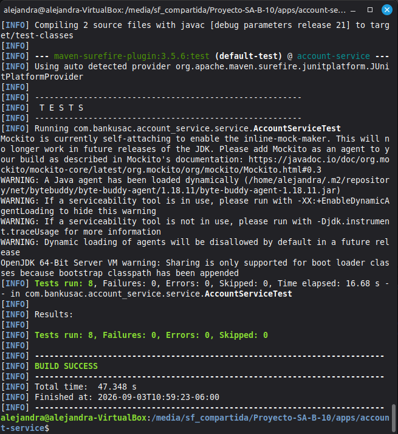
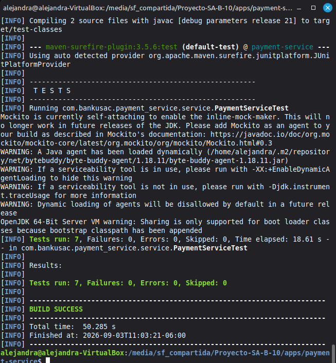

# Evidencia de Pruebas

Este documento contiene la evidencia de ejecución de las pruebas unitarias de Account Service y Payment Service.

## Account Service

8 pruebas unitarias con Mockito, cobertura de:
- Creación de cuenta con valores iniciales correctos
- Consulta de saldo disponible (balance menos monto reservado)
- Reserva de fondos exitosa
- Reserva de fondos con error por fondos insuficientes
- Idempotencia (evento ya procesado no se vuelve a ejecutar)
- Aplicación de transferencia entre cuenta origen y destino
- Desactivación automática de cuenta con bajo balance y sin actividad
- No desactivación si la cuenta tiene balance suficiente

```bash
mvn test
```



## Payment Service

7 pruebas unitarias con Mockito, cobertura de:
- Procesamiento de pago aprobado (monto válido)
- Procesamiento de pago rechazado (monto igual a cero)
- Procesamiento de pago rechazado (monto negativo)
- Reacción al evento `account.funds.reserved` publicando `payment.approved`
- Reacción al evento `account.funds.reserved` publicando `payment.rejected`
- Idempotencia (evento ya procesado no se vuelve a ejecutar)
- Consulta del historial de pagos

```bash
mvn test
```



## Resumen

| Servicio | Pruebas | Resultado |
|---|---|---|
| Account Service | 8 | BUILD SUCCESS |
| Payment Service | 7 | BUILD SUCCESS |
| **Total** | **15** | **Sin fallos** |