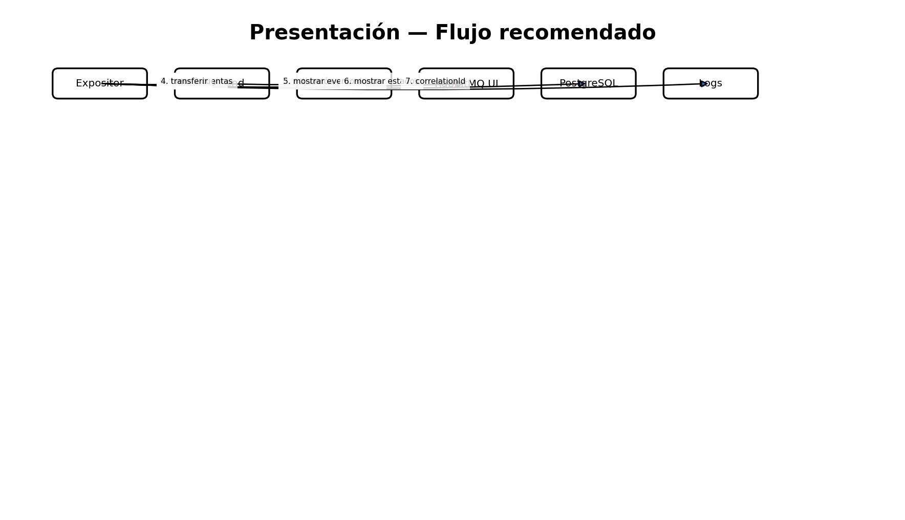

# Guía de demostración / sustentación

1. Mostrar `docker compose ps` o `kubectl get pods`.
2. Mostrar C4 contexto/contenedores y Deployment.
3. Registrar un Cliente y abrir MailHog para enseñar correo de activación.
4. Login y explicar claims JWT `customerId` y `role`.
5. Crear cuenta monetaria Q1500 y ahorro Q100.
6. Abrir RabbitMQ UI y enseñar `bank.events`, queues y DLQ.
7. Ejecutar transferencia Q250.
8. Mostrar logs de Transaction/Account/Payment filtrando el mismo `correlationId`.
9. Consultar estado `COMPLETED` y enseñar saldos Q1250/Q350.
10. Ingresar como `admin` / `Admin123!` y mostrar auditoría; luego `cashier` / `Cashier123!` para pagos.
11. Ejecutar `./scripts/project/smoke-local.sh` y `./scripts/project/smoke-roles-local.sh` como evidencia automática.
12. Para resiliencia, enviar un evento inválido y mostrar retry/DLQ si se solicita.

