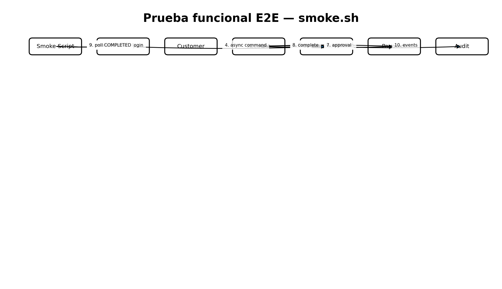

# Estrategia de pruebas

## Unitarias/integración
Transaction conserva sus pruebas Vitest de dominio e integración PostgreSQL. Customer conserva pruebas Spring. Los builds de todos los servicios se ejecutan en `15_validate_project.sh` cuando las herramientas/dependencias están disponibles.

## E2E
`tests/e2e/smoke.sh` ejecuta:
1. registro de Cliente;
2. activación;
3. login y JWT;
4. creación de cuenta monetaria y ahorro;
5. transferencia Q250;
6. polling por `correlationId` hasta `COMPLETED`;
7. consulta de saldos.

Local: `./scripts/project/smoke-local.sh`.
Kubernetes: `./scripts/project/smoke-k8s.sh`.

## Prueba de roles
`tests/e2e/roles.sh` valida login de ADMIN/CASHIER, acceso ADMIN a auditoría, acceso CASHIER a pagos y denegación 403 de auditoría al cajero.

## Pruebas de fallo/compensación
`tests/e2e/saga-failures.sh` valida dos escenarios exigibles en la Saga:
- saldo insuficiente: termina `FAILED` sin movimiento de saldo;
- rechazo de Payment posterior a la reserva: termina `COMPENSATED` y el saldo origen vuelve al valor previo.

Local: `./scripts/project/smoke-saga-failures-local.sh`.
Kubernetes: `./scripts/project/smoke-saga-failures-k8s.sh`.
