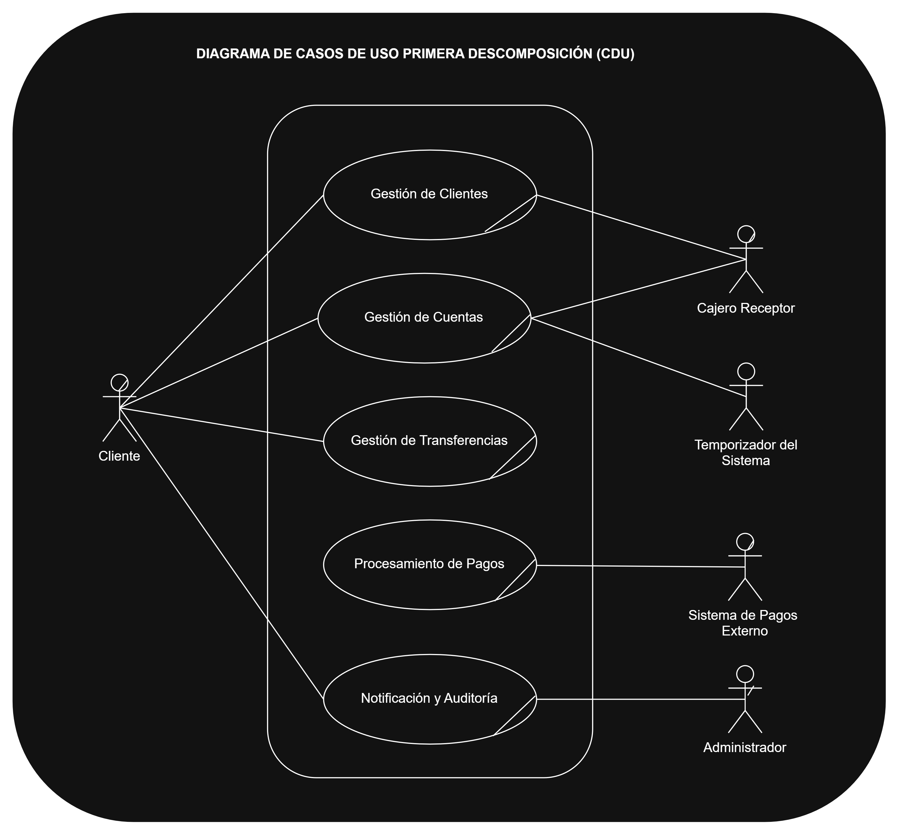
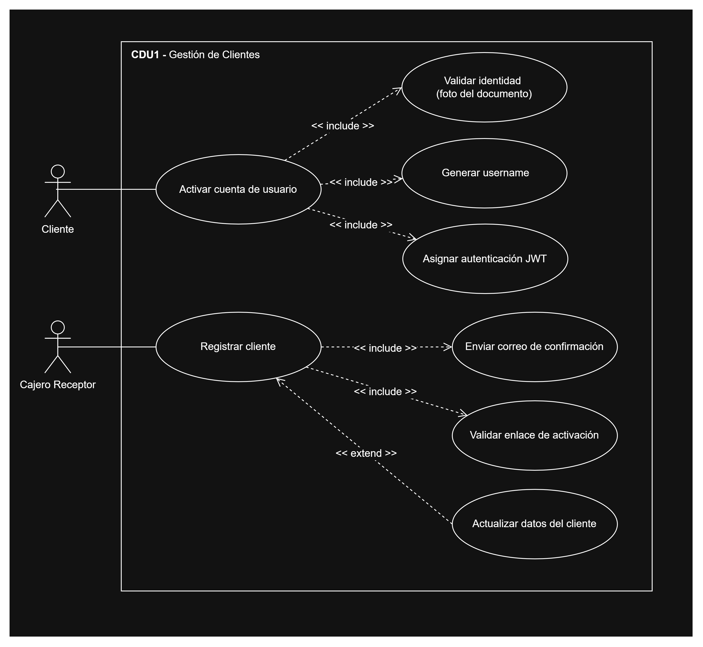
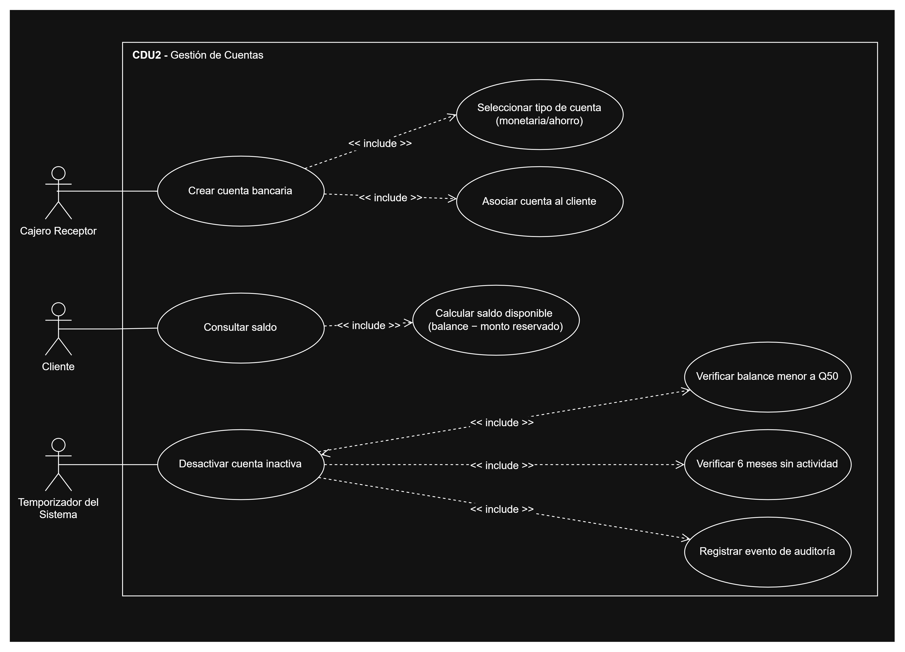
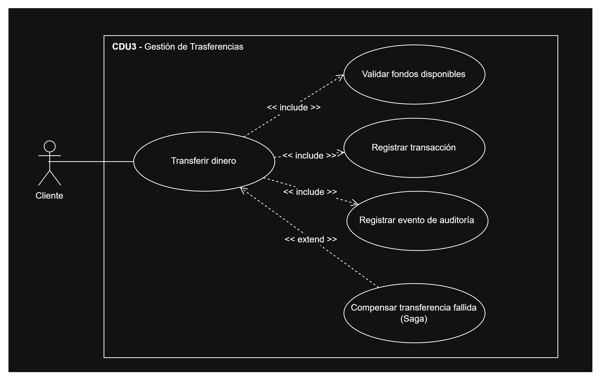
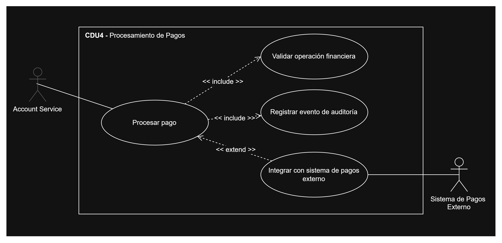
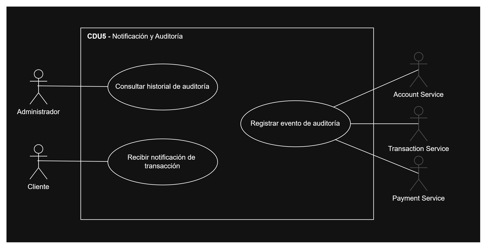

# Diagrama de Casos de Uso

Este documento describe los casos de uso del sistema Bank USAC, organizados por microservicio, incluyendo actores, relaciones `<<include>>`/`<<extend>>`, y conexiones entre casos de uso de distintos microservicios.

## Descomposición general

El sistema cuenta con 5 actores primarios/secundarios (Cliente, Cajero Receptor, Administrador, Temporizador del Sistema, Sistema de Pagos Externo) y 5 grupos de casos de uso, uno por microservicio: Gestión de Clientes, Gestión de Cuentas, Gestión de Transferencias, Procesamiento de Pagos, y Notificación y Auditoría.

## CDU001 — Gestión de Clientes

Actores: Cliente, Cajero Receptor. Incluye registro de cliente, validación de identidad, activación de cuenta de usuario.

## CDU002 — Gestión de Cuentas

Actores: Cajero Receptor, Cliente, Temporizador del Sistema. Incluye creación de cuenta, consulta de saldo, y desactivación automática de cuentas inactivas (proceso disparado por tiempo, sin intervención de un actor humano).

## CDU003 — Gestión de Transferencias

Actor: Cliente. Incluye validación de fondos, registro de transacción, y compensación de transferencia fallida (Saga).

## CDU004 — Procesamiento de Pagos

Actores: Account Service (como sistema externo desde la perspectiva de Payment Service), Sistema de Pagos Externo. El procesamiento de pagos es disparado automáticamente por el evento `account.funds.reserved`, sin intervención manual del usuario final.

## CDU005 — Notificación y Auditoría

Actores: Administrador, Cliente, Account Service, Transaction Service, Payment Service. El registro de eventos de auditoría es disparado por los demás microservicios del sistema cada vez que ocurre una operación relevante (transferencia, pago, desactivación de cuenta).

