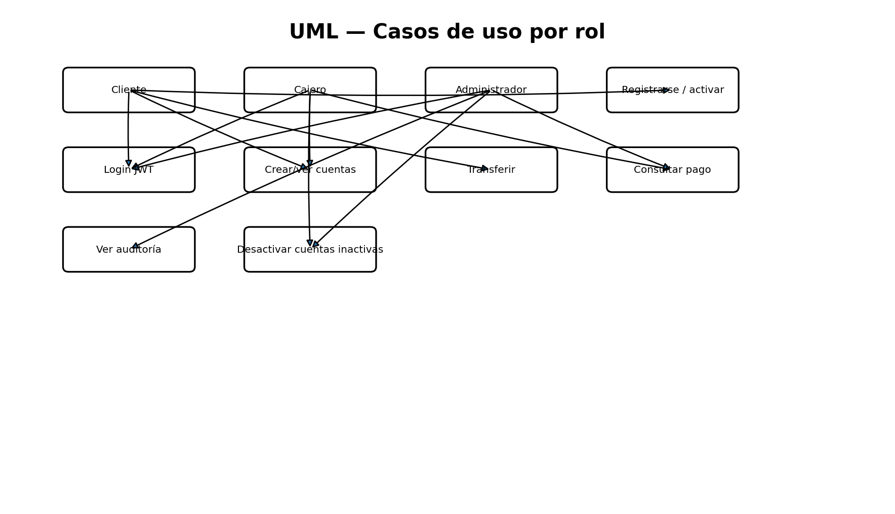

# Casos de uso

## Cliente
- registrarse y activar cuenta por correo;
- autenticarse con JWT;
- consultar/actualizar perfil;
- crear cuenta monetaria o de ahorro;
- consultar saldos;
- iniciar transferencia y consultar su estado.

## Cajero receptor
- autenticarse;
- crear y consultar cuentas para clientes;
- consultar pagos procesados;
- ejecutar mantenimiento autorizado de cuentas inactivas.

## Administrador
- autenticarse;
- consultar auditoría distribuida;
- consultar pagos;
- ejecutar mantenimiento de cuentas.

